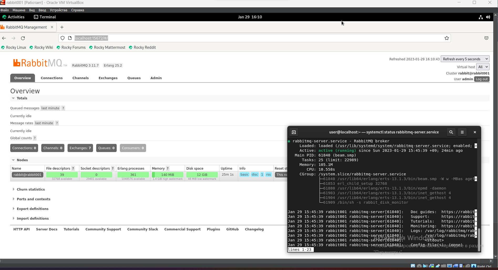
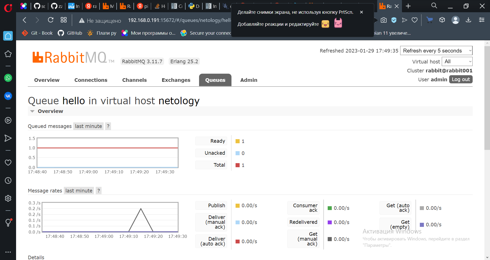
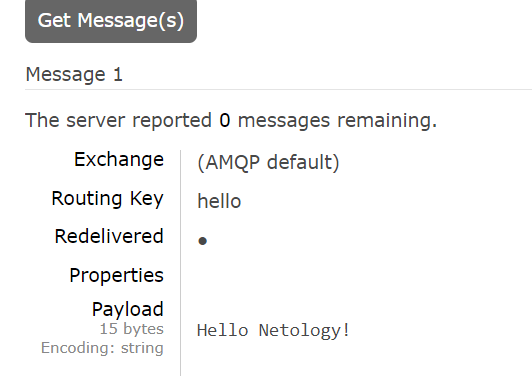
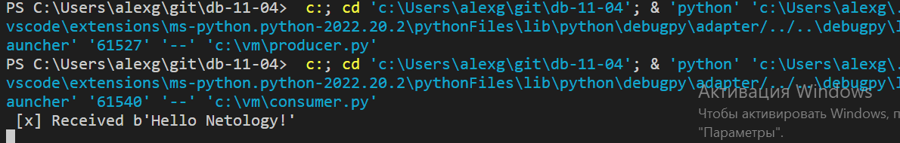
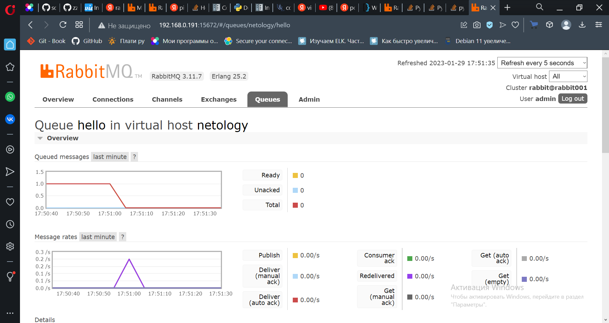
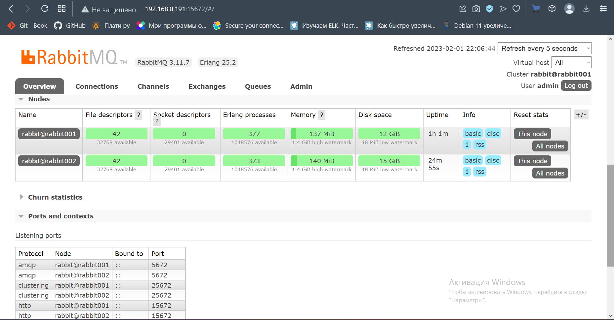
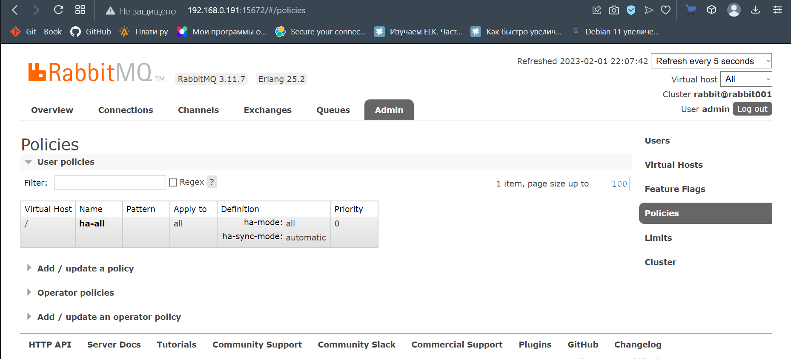
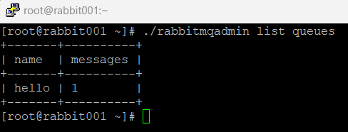
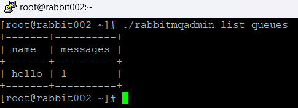
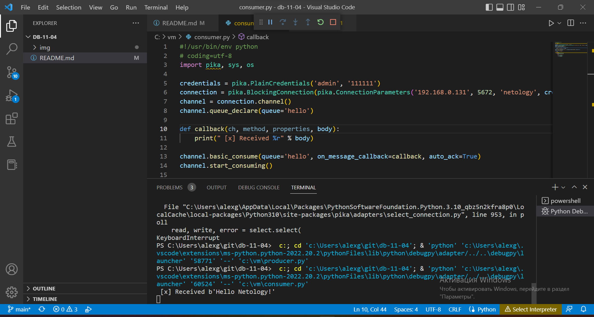

# 11.4. «Очереди RabbitMQ» - Александр Гумлевой

### Задание 1. Установка RabbitMQ

Используя Vagrant или VirtualBox, создайте виртуальную машину и установите RabbitMQ.
Добавьте management plug-in и зайдите в веб-интерфейс.



---

### Задание 2. Отправка и получение сообщений

Используя приложенные скрипты, проведите тестовую отправку и получение сообщения.
Для отправки сообщений необходимо запустить скрипт producer.py.

Для выполнения пришлось модифицировать скрипт consumer.py по туториалу https://www.rabbitmq.com/tutorials/tutorial-one-python.html .

<details>
  <summary>consumer.py</summary>
  
  ```python
import pika, sys, os

credentials = pika.PlainCredentials('admin', '111111')
connection = pika.BlockingConnection(pika.ConnectionParameters('192.168.0.191', 5672, 'netology', credentials))
channel = connection.channel()
channel.queue_declare(queue='hello')


def callback(ch, method, properties, body):
    print(" [x] Received %r" % body)


channel.basic_consume(queue='hello', on_message_callback=callback, auto_ack=True)
channel.start_consuming()

if __name__ == '__main__':
    try:
        main()
    except KeyboardInterrupt:
        print('Interrupted')
        try:
            sys.exit(0)
        except SystemExit:
            os._exit(0)
  ```
</details>

#### Скрин веб-интерфейса после выполнения producer.py



#### Скрин сообщения



#### Скрин консоли VSCode после выполнения producer.py и consumer.py



#### Скрин веб-интерфейса после выполнения consumer.py


---

### Задание 3. Подготовка HA кластера

Используя Vagrant или VirtualBox, создайте вторую виртуальную машину и установите RabbitMQ.
Добавьте в файл hosts название и IP-адрес каждой машины, чтобы машины могли видеть друг друга по имени.

#### Скрин ноды кластера



#### Скрин политики



<details>
  <summary>rabbitmqctl cluster_status нода 1 rabbit001</summary>

```shell script
Cluster status of node rabbit@rabbit001 ...
Basics

Cluster name: rabbit@rabbit001

Disk Nodes

rabbit@rabbit001
rabbit@rabbit002

Running Nodes

rabbit@rabbit001
rabbit@rabbit002

Versions

rabbit@rabbit001: RabbitMQ 3.11.7 on Erlang 25.2
rabbit@rabbit002: RabbitMQ 3.11.7 on Erlang 25.2

Maintenance status

Node: rabbit@rabbit001, status: not under maintenance
Node: rabbit@rabbit002, status: not under maintenance

Alarms

(none)

Network Partitions

(none)

Listeners

Node: rabbit@rabbit001, interface: [::], port: 15672, protocol: http, purpose: HTTP API
Node: rabbit@rabbit001, interface: [::], port: 25672, protocol: clustering, purpose: inter-node and CLI tool communication
Node: rabbit@rabbit001, interface: [::], port: 5672, protocol: amqp, purpose: AMQP 0-9-1 and AMQP 1.0
Node: rabbit@rabbit002, interface: [::], port: 15672, protocol: http, purpose: HTTP API
Node: rabbit@rabbit002, interface: [::], port: 25672, protocol: clustering, purpose: inter-node and CLI tool communication
Node: rabbit@rabbit002, interface: [::], port: 5672, protocol: amqp, purpose: AMQP 0-9-1 and AMQP 1.0

Feature flags

Flag: classic_mirrored_queue_version, state: enabled
Flag: classic_queue_type_delivery_support, state: enabled
Flag: direct_exchange_routing_v2, state: enabled
Flag: drop_unroutable_metric, state: enabled
Flag: empty_basic_get_metric, state: enabled
Flag: feature_flags_v2, state: enabled
Flag: implicit_default_bindings, state: enabled
Flag: listener_records_in_ets, state: enabled
Flag: maintenance_mode_status, state: enabled
Flag: quorum_queue, state: enabled
Flag: stream_queue, state: enabled
Flag: stream_single_active_consumer, state: enabled
Flag: tracking_records_in_ets, state: enabled
Flag: user_limits, state: enabled
Flag: virtual_host_metadata, state: enabled

```
</details>

<details>
  <summary>rabbitmqctl cluster_status нода 2 rabbit002</summary>
  
```shell script
Cluster status of node rabbit@rabbit002 ...
Basics

Cluster name: rabbit@rabbit002

Disk Nodes

rabbit@rabbit001
rabbit@rabbit002

Running Nodes

rabbit@rabbit001
rabbit@rabbit002

Versions

rabbit@rabbit001: RabbitMQ 3.11.7 on Erlang 25.2
rabbit@rabbit002: RabbitMQ 3.11.7 on Erlang 25.2

Maintenance status

Node: rabbit@rabbit001, status: not under maintenance
Node: rabbit@rabbit002, status: not under maintenance

Alarms

(none)

Network Partitions

(none)

Listeners

Node: rabbit@rabbit001, interface: [::], port: 15672, protocol: http, purpose: HTTP API
Node: rabbit@rabbit001, interface: [::], port: 25672, protocol: clustering, purpose: inter-node and CLI tool communication
Node: rabbit@rabbit001, interface: [::], port: 5672, protocol: amqp, purpose: AMQP 0-9-1 and AMQP 1.0
Node: rabbit@rabbit002, interface: [::], port: 15672, protocol: http, purpose: HTTP API
Node: rabbit@rabbit002, interface: [::], port: 25672, protocol: clustering, purpose: inter-node and CLI tool communication
Node: rabbit@rabbit002, interface: [::], port: 5672, protocol: amqp, purpose: AMQP 0-9-1 and AMQP 1.0

Feature flags

Flag: classic_mirrored_queue_version, state: enabled
Flag: classic_queue_type_delivery_support, state: enabled
Flag: direct_exchange_routing_v2, state: enabled
Flag: drop_unroutable_metric, state: enabled
Flag: empty_basic_get_metric, state: enabled
Flag: feature_flags_v2, state: enabled
Flag: implicit_default_bindings, state: enabled
Flag: listener_records_in_ets, state: enabled
Flag: maintenance_mode_status, state: enabled
Flag: quorum_queue, state: enabled
Flag: stream_queue, state: enabled
Flag: stream_single_active_consumer, state: enabled
Flag: tracking_records_in_ets, state: enabled
Flag: user_limits, state: enabled
Flag: virtual_host_metadata, state: enabled
```
</details>

Для закрепления материала снова запустите скрипт producer.py и приложите скриншот выполнения команды на каждой из нод:

```shell script
$ rabbitmqadmin get queue='hello'
```
#### Скрин ноды rabbit001



#### Скрин ноды rabbit002



После чего попробуйте отключить одну из нод, желательно ту, к которой подключались из скрипта, затем поправьте параметры подключения в скрипте consumer.py на вторую ноду и запустите его.

#### Результат работы consumer.py, сообщение получено с ноды 2 rabbit002

